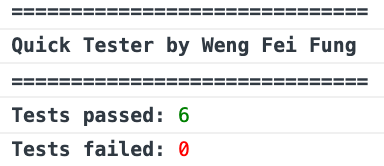

Quick Tester JS by Weng
================
Quick assertion testing and pass/fail reports for javascript. 
By Weng Fei Fung.

Instructions
--------------
- Evaluate statements with tester.assert(eval, "error message if failed")
- Report pass and fail numbers with tester.report();

Screenshot
--------------
